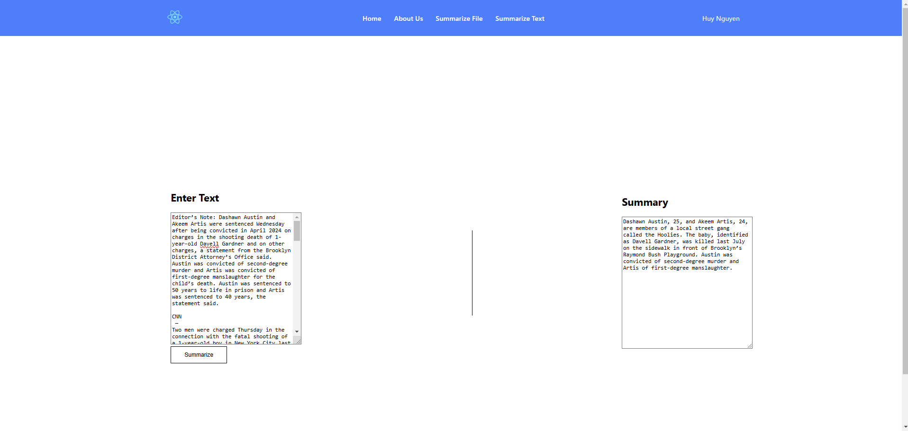
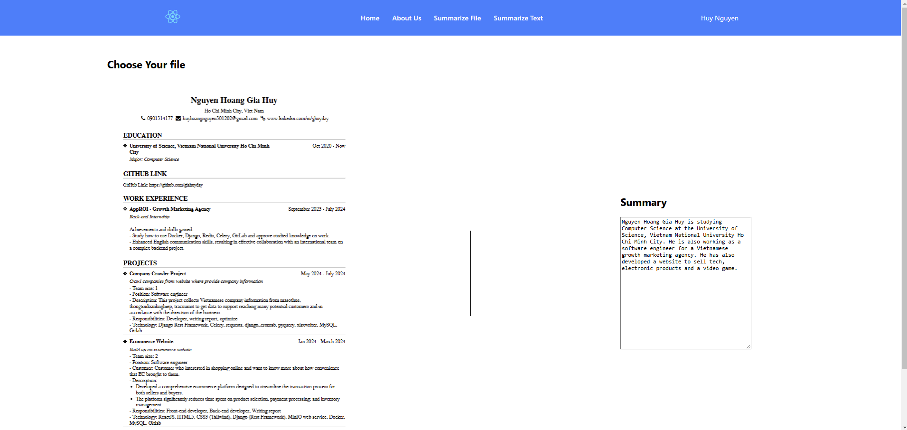

# Web Application: Text and PDF Summarization

This project is a **React-based web application** that provides functionality to summarize text and PDF documents. Users can input plain text or upload PDF files to receive concise summaries generated by an AI model.

---

## **Features**

-   **Text Summarization**: Input plain text into a text area to generate a summary.
    
-   **PDF Summarization**: Upload PDF files and receive a summarized version of the content.
    

---

## **Tech Stack**

-   **Frontend**: React.js, HTML5, CSS3
-   **Backend**: FastAPI (or an external API endpoint)
-   **PDF Parsing**: PyMuPDF for text extraction from PDFs
-   **Text Summarization**: Hugging Face Transformers (e.g., BERT or BART models)

---

## **Project Structure**

```
📁text-summarization/
├── 📁public/
└── 📁src
    └── 📁components
        └── header.js
    └── 📁pages
        └── file_summary.js
        └── text_summary.js
    ├── App.css
    ├── App.js
    ├── App.test.js
    ├── index.css
    ├── index.js
    ├── logo.svg
    ├── App.js
│   └── index.js
├── .env
├── package.json
├── README.md
```

---

## **Running the Project Locally**

### **1. Clone the Repository**

```bash
git clone git@github.com:giahuyday/text-summarization.git
cd text-summarization
```

### **2. Install Dependencies**

Ensure you have Node.js and npm installed. Then, run:

```bash
npm install
```

Replace the URL with your backend's endpoint if necessary.

### **4. Start the Development Server**

```bash
npm start
```

The application will run on `http://localhost:3000/` by default.

---

## **API Integration**

The web application interacts with a backend summarization API. Ensure the API is running before using the app. The expected API endpoints:

## **Deployment**

### **1. Build the Application**

Run the following command to create an optimized production build:

```bash
npm run build
```

### **2. Serve the Build**

Deploy the contents of the `build/` directory to any static hosting service (e.g., Vercel, Netlify, AWS S3).

---

## **Future Enhancements**

-   Add support for summarization of more file types (e.g., Word documents).
-   Implement user authentication for secure access.
-   Provide language options for text summarization.
-   Include a history of past summarizations for users.

---
